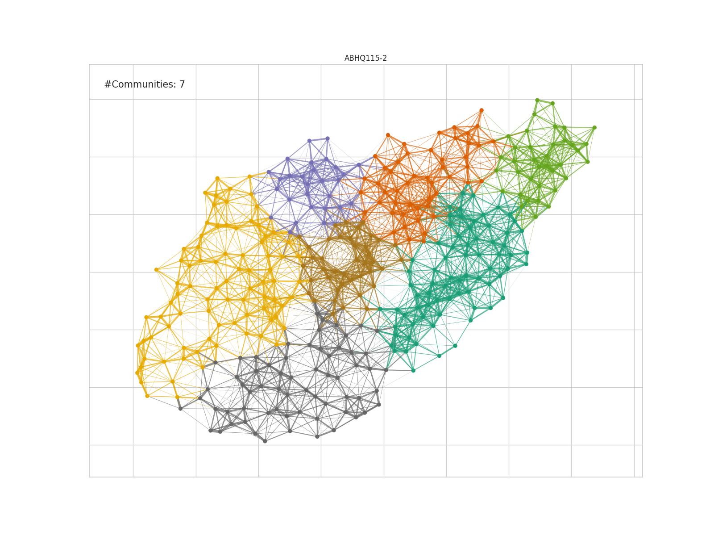
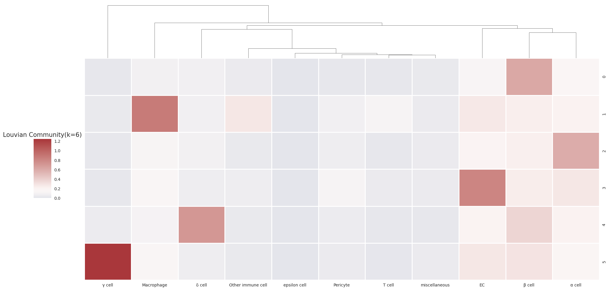
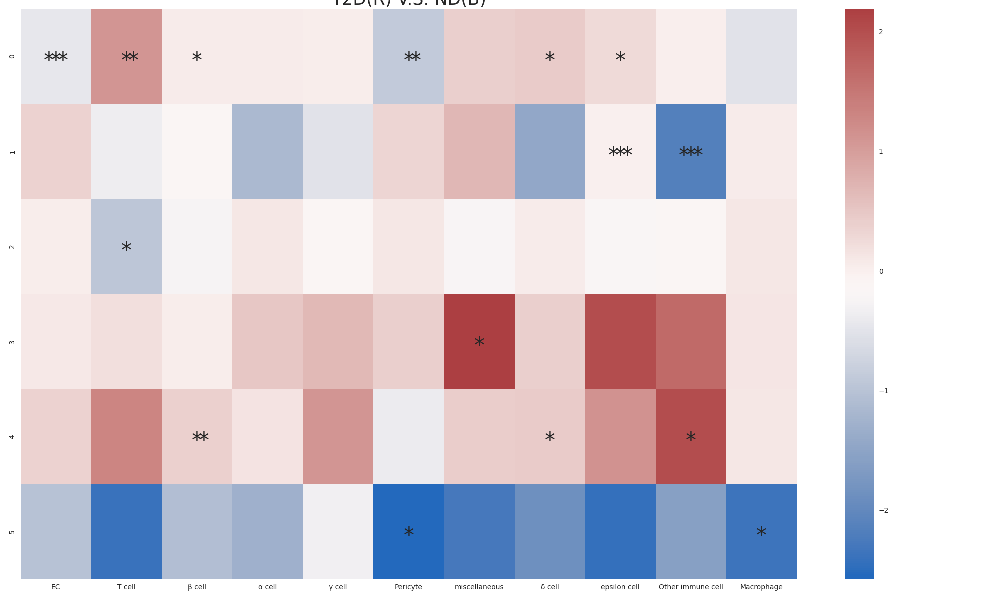
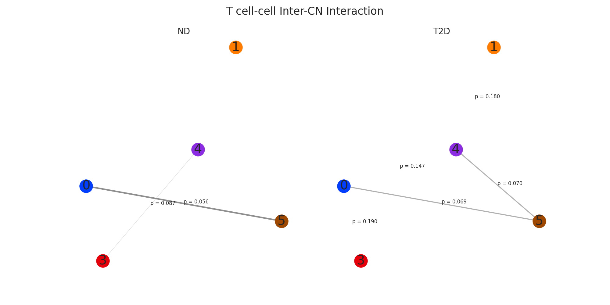

# GCD_CFIDF
Graph-based enrichment analysis algorithm for Nature paper 'RFX6-mediated dysregulation defines human β cell dysfunction in early type 2 diabetes'(https://www.biorxiv.org/content/10.1101/2021.12.16.466282v1)


## Run Graph Community Detection using louvian algorithm
```
bash scripts/gcd.sh
```

## Run Enrichment Analysis with CFIDF metrics
```
bash scripts/run.sh
```
You will find all the analysis figures (sample graph community plots, cell neighborhood enrichment heatmap, T2D-ND enrichment difference heatmap by celltype, celltype CCA analysis graph plots) in the 'fig_dir' directory as you defined :)


## Analysis Results (num_cluster=6; resolution=0.5)

### Graph Community Partition


### Enrichment analysis


### T2D-ND Enrichment Difference


### Sample CCA analysis

